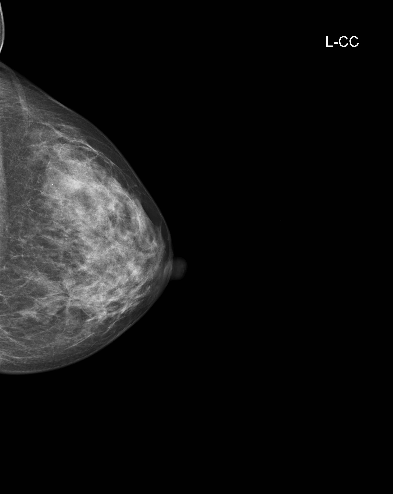
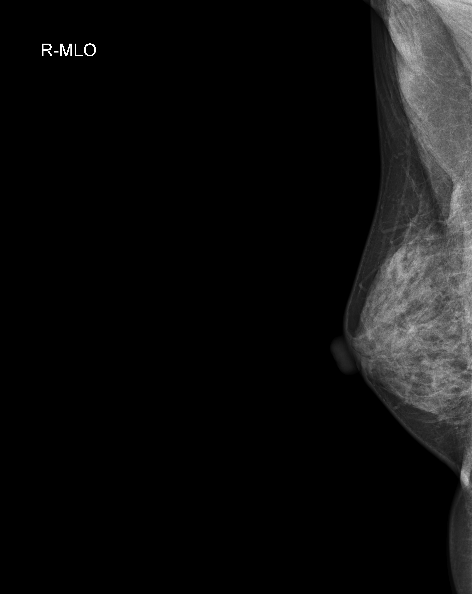
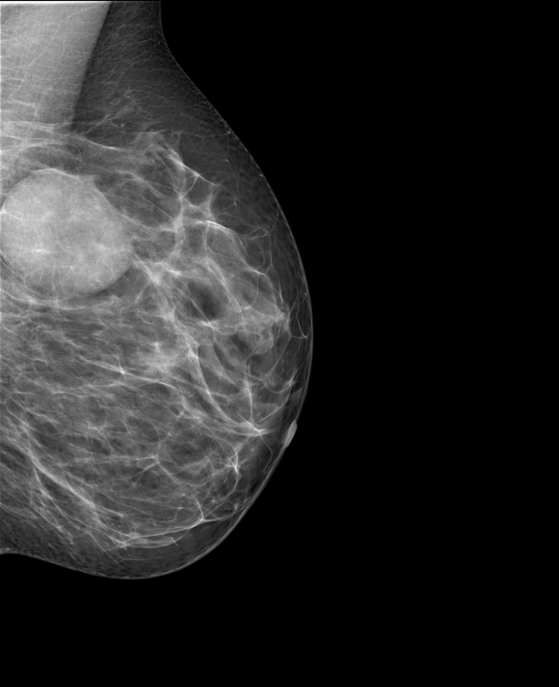
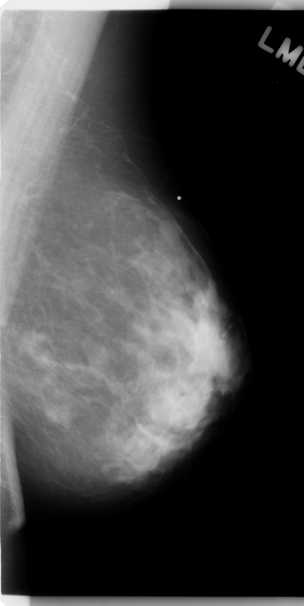
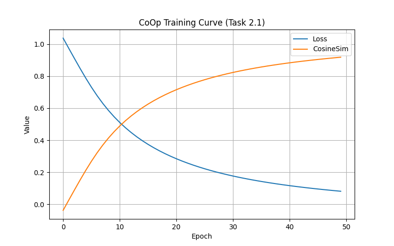
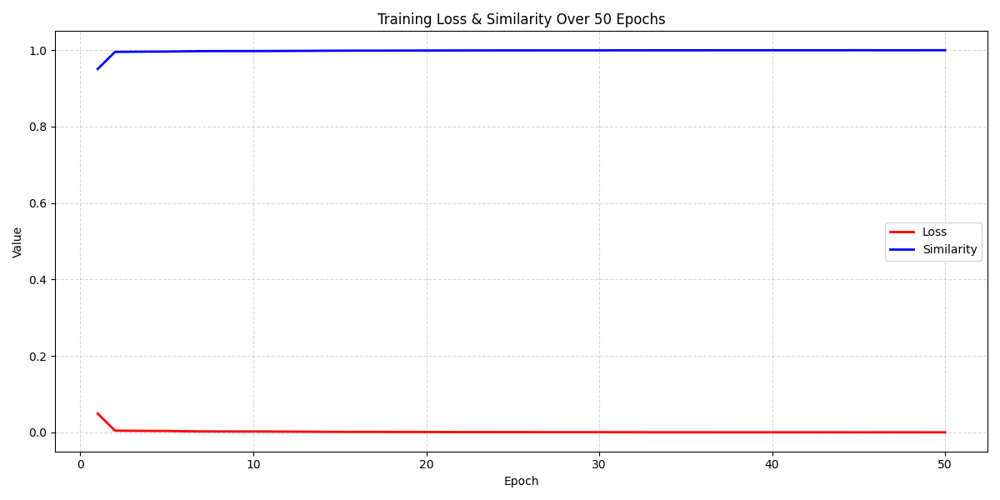
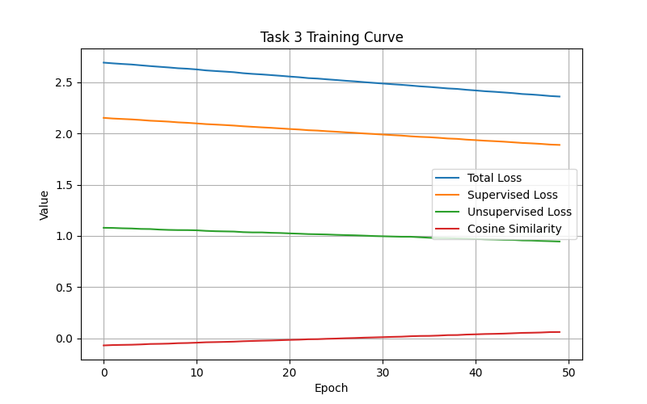

<div align="center">

# Vision-Language-Mammography-Detection

### GroundingDINO-based Open-Vocabulary Mammography Detection  
### CoOp · CoCoOp · Semi-Supervised Vision-Language Alignment

<br>

<p align="center">
  
  
  
  
</p>

<br>


</div>

---

## Overview

**Vision-Language-Mammography-Detection** explores open-vocabulary lesion grounding in mammography using a vision-language training pipeline built on top of **GroundingDINO**.

Core research directions include:

- Open-vocabulary mammography detection
- Vision-language feature alignment
- CoOp prompt learning
- CoCoOp prompt learning
- Hybrid semi-supervised optimization
- Weakly supervised grounding for medical imaging

Designed for modular experimentation and reproducible research workflows.

---

## Repository Structure

```text
src/
├── detection/
├── evaluation/
├── prompt_learning/
├── training/
└── utils/
```

---

## Training Dynamics

<div align="center">

### CoOp Prompt Learning



<br><br>

### CoCoOp Prompt Learning



<br><br>

### Hybrid Semi-Supervised Training



</div>

---

## Installation

```bash
git clone https://github.com/your-username/Vision-Language-Mammography-Detection.git

cd Vision-Language-Mammography-Detection

pip install -r requirements.txt
```

### Install GroundingDINO

```bash
git clone https://github.com/IDEA-Research/GroundingDINO.git

cd GroundingDINO

pip install -e .

cd ..
```

---

## Training

```bash
python -m src.training.train
```

### Prompt Learning

```bash
python -m src.prompt_learning.train_coop

python -m src.prompt_learning.train_cocoop
```

### Evaluation

```bash
python -m src.evaluation.evaluate
```

---

## Core Components

| Module | Description |
|---|---|
| `detection/` | GroundingDINO-based open-vocabulary detection |
| `prompt_learning/` | CoOp and CoCoOp prompt optimization |
| `training/` | Semi-supervised and hybrid training pipelines |
| `evaluation/` | Localization and grounding evaluation |
| `utils/` | Shared utilities and experiment helpers |

---

## Research Focus

- Vision-language representation learning for mammography
- Prompt-conditioned grounding
- Open-vocabulary medical detection
- Semi-supervised lesion localization
- Robust feature alignment under limited annotation settings

---

<div align="center">

Research-oriented computer vision repository for vision-language mammography grounding.

</div>
